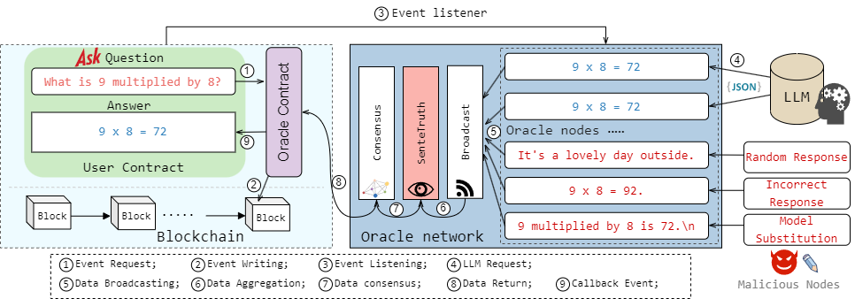

# CLLM
> Connecting Large Language Models with Blockchain: Making Smart Contracts Smarter

### 效果图 (Application examples)


### 架构图 (Architecture diagram)


### 目录结构 (Directory structure)

```
1. contracts: smart contract
2. node: oracle node
3. web
4. datas
```
### 依赖环境 (Depends on environment)
```
1. Ganache
2. Vue2
3. Pytorch
4. web3.py
```

### 运行流程 (Workflow)
```
1. Install Miniconda.
2. Create a conda environment:  
   `conda create --name <environment_name> python=3.9`
3. Activate the conda environment:  
   `conda activate <environment_name>`
4. Install dependencies in the conda environment: numpy, pandas, matplotlib, web3, and pytorch libraries (CUDA >= 11.3... see below for conda environment dependencies).
5. Deploy the smart contract (contracts/OracleContract.sol): First deploy the Oracle contract, then deploy the UserContract contract using its address.
6. Start the backend: Modify the contract address, wallet public key, and private key in the backend constants (node/constantModule.py), configure the LLM API key (node/utils/llm_api.py), and then run the backend (node/node.py).
7. Start the frontend: Download node.js, then launch the frontend in the console (web/llm-orcle-front). After installing dependencies (`npm install`), modify the frontend constants (web/llm-orcle-front/src/contractABI/userContract.js) with the contract address and wallet private key. Finally, start the service (`npm run serve`).
```

### Python环境依赖库 (Python environment dependency library)
```
pip install -r requirements.txt
```

### 前端依赖项 (Frontend dependencies)
```
"core-js": "^3.8.3",
"element-ui": "^2.15.14",
"ethers": "^6.13.1",
"vue": "^2.6.14",
"vue-router": "^3.5.1",
"vuex": "^3.6.2"
```
